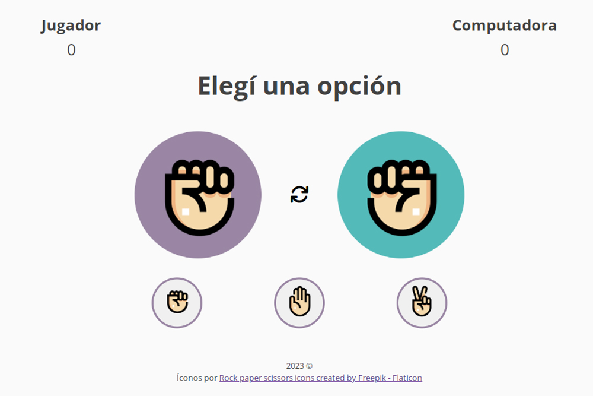

# Juego Pedra, Papel o Tijera :fist: :hand: :v:

Bienvenido al repositorio del juego Piedra, Papel o Tijera. 
Este juego pertenece a un Workshop de desarrollo FrontEnd de [Ada ITW](https://adaitw.org/).

   

Creado con [JavaScript](https://es.javascript.info/), estructura con [HTML5](https://lenguajehtml.com/) y estilos con [CSS3](https://lenguajecss.com/).

   
   
   

## Contenido 

El juego consiste en presionar uno de los tres botones que aparecen en la parte inferior de la página, los cuales representan "piedra", "papel" o "tijera". Una vez elegida una opción, se visualizará la elección que toma la computadora y, dependiendo el resultado, se informará en el título si el usuario ha ganado, perdido o empatado. Esto también se reflejará en forma de puntaje, según corresponda. Para reiniciar el juego se podrá presionar el botón "resetear" que figura en el centro de la página.

## Sobre mí

Hola, soy **Vanesa!** :wave: :smile: Me encuentro realizando mis primeros pasos en el mundo del desarrollo web. Te invito a pasar por mi [repositorio](https://github.com/vaneh14).